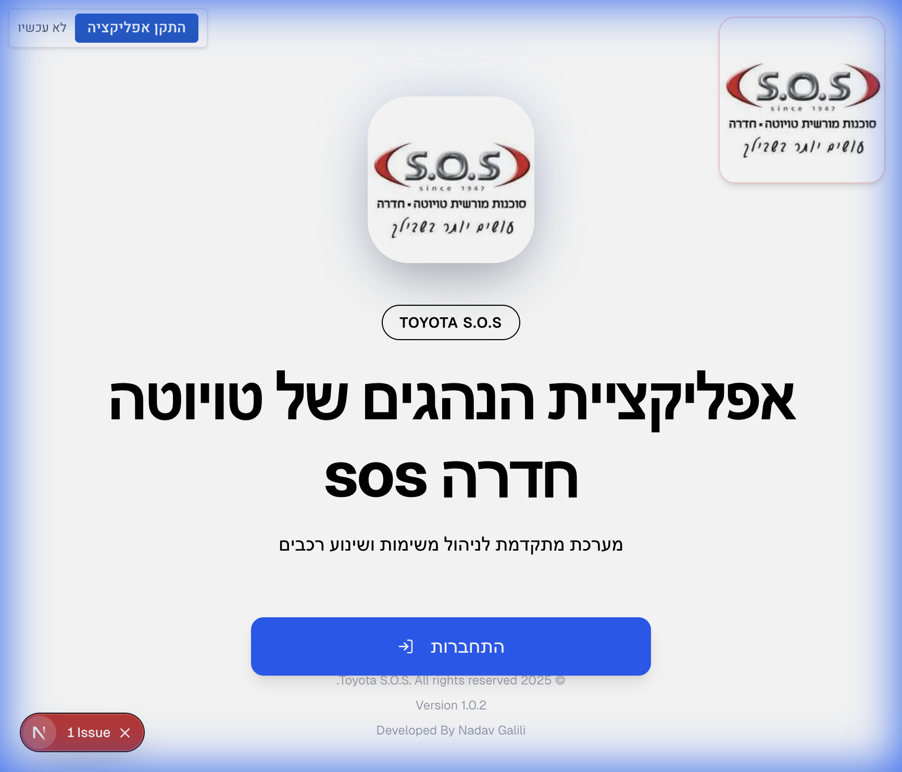
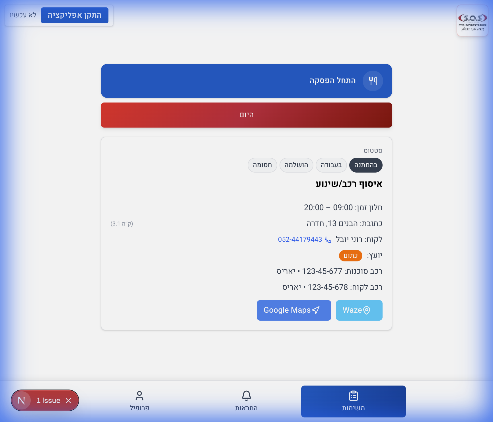
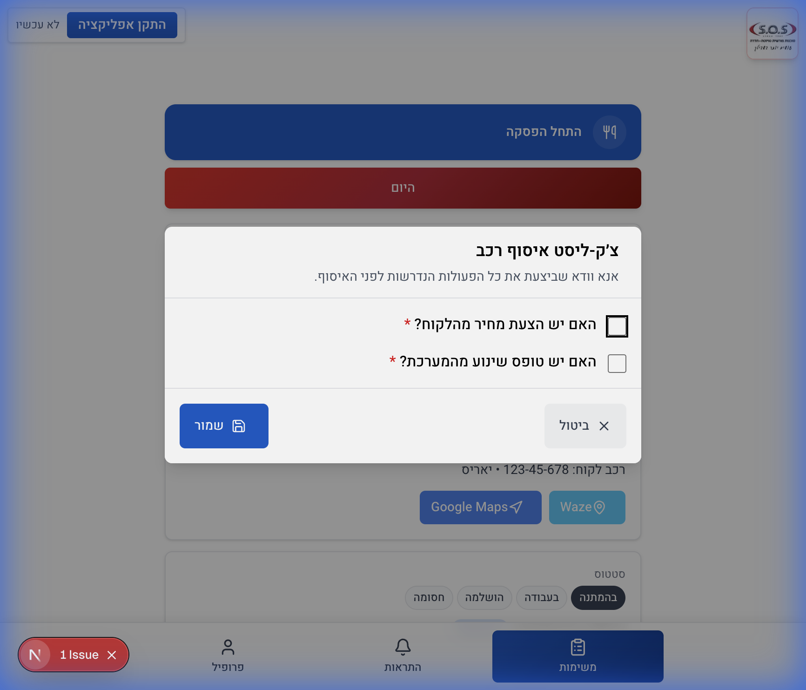

# מדריך למשתמש - אפליקציית נהגים (Toyota S.O.S)

ברוכים הבאים לאפליקציית הנהגים של Toyota S.O.S.
מדריך זה ילווה אותך בצעדים הראשונים לשימוש במערכת, החל מהתחברות ועד לביצוע משימות.

## 1. התחברות למערכת (Login)

בכניסה לאפליקציה, יופיע מסך ההזדהות.
יש להזין את **מספר העובד** האישי שלך בשדה המתאים.

*   **דוגמה:** הזן את הקוד `33333`.
*   לאחר ההקלדה, לחץ על כפתור **"כניסה"** (או האייקון של החץ).

---

## 2. לוח המשימות (Dashboard)

לאחר התחברות מוצלחת, תועבר ללוח המשימות האישי שלך.
כאן תוכל לראות את כל המשימות המשויכות אליך, מסודרות לפי סטטוס (ממתין, בעבודה, הושלם).

*   כל כרטיסייה מייצגת משימה.
*   תוכל לראות פרטים בסיסיים כמו סוג המשימה, כתובת, ושעות משוערות.

---

## 3. ביצוע משימה וצפייה בפרטים

כדי להתחיל משימה או לצפות בפרטים נוספים:
1.  לחץ על כרטיס המשימה הרצוי.
2.  במידה והמשימה דורשת רשימת תיוג (Checklist) או פעולות נוספות (כמו איסוף רכב), יפתח חלון עם הפרטים המלאים.
3.  יש לעקוב אחר ההוראות (למשל: סימון "לקחת רישיון רכב", "לקחת רישיון לקוח").
4.  בסיום, ניתן לעדכן סטטוס או לשמור.

---

## סיכום

האפליקציה נועדה להיות פשוטה ונוחה לשימוש. בכל בעיה או שאלה, ניתן לפנות למנהל המערכת.
נסיעה טובה ובטוחה!
